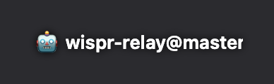
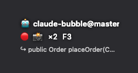
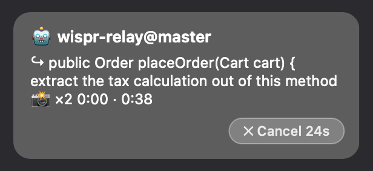

# Wispr Relay

A small macOS overlay that **relays [Wispr Flow](https://wisprflow.ai) dictation
into a running coding agent** — along with the text you had selected and
screenshots of what you were looking at — so you can drive the agent while
looking at something else entirely: a browser, an IDE, a projector.

Wispr Flow types its transcript wherever the caret is, which is exactly wrong
when you are talking *about* something you are only reading. Wispr Relay takes
that same speech and sends it somewhere else: to whatever agent is watching its
queue. That is the whole idea, and the name — it is not tied to any one agent
(it was called Claude Bubble until it turned out to work with all of them).

It is **one-way and non-interactive** by design. The agent gets your words; it
cannot ask you anything back, because you are not reading the terminal.



At rest it is just a label riding along near your cursor, telling you *which*
session is listening — `folder@branch`, the same thing Claude Code's status line
shows. It disappears while you type and comes back when you move the mouse.



When dictation starts the chip stays where it is and grows one row: a pulsing 🔴,
how many pictures the message is carrying, and the key that adds another
(`🔴 📸 ×2 F3`). Behind that row the screen is photographed, whatever was
selected is captured and frozen for the whole dictation, and **F3** attaches
extra screenshots as you talk — the count going up is the receipt.



The finished prompt is shown whole — and **held for 4–7 seconds behind a Cancel
button** before it is written anywhere. That delay is the feature: once a line is
in the queue the agent may already be acting on it, so the only honest moment to
cancel is before it is written.

## How it reaches the agent

The overlay appends JSON lines to `~/.wispr-relay/outbox.jsonl`. Anything that
watches that file can consume them; there is no back-channel.

```json
{"ts":"2026-07-30T08:12:03Z","session":"myrepo@main","kind":"dictation",
 "text":"extract the tax calculation out of this method",
 "selection":"public Order placeOrder(Cart cart) {","app":"com.microsoft.VSCode"}
```

`kind` is `dictation` | `screenshot` | `session_end`. Every message carries the
`session` it belongs to, so several overlays can share one queue without an agent
acting on another project's words.

Any agent that can tail a file will do. The Claude Code side is the `relay` skill
in [`victorrentea/ai`](https://github.com/victorrentea/ai) (`skills/relay/`),
which ships the built binary, installs `/relay`, and watches the outbox.

## Input

| input | effect |
|---|---|
| start dictating | Red flash, screen captured, selection grabbed — all automatic |
| **F3** | One more screenshot, attached to the dictation in progress |
| **Cancel** | Stops the displayed prompt from ever being written |
| click | On a prompt: send it now. Otherwise: pause / resume forwarding |
| hover | Reveals the ✕ that ends the session (panel states only) |
| menu bar 🤖 | Always there while the app runs — shows which session it is, and **Exit** |

## How dictation is captured

[Wispr Flow](https://wisprflow.ai) pastes its transcript wherever the caret is,
which is useless when you are dictating *about* something you are only reading.
So the overlay reads Wispr's own local history instead:
`~/Library/Application Support/Wispr Flow/flow.sqlite`, opened **read-only** and
polled once a second for rows newer than a watermark taken at startup.

The selection is read via Accessibility (`kAXSelectedTextAttribute`), falling
back to a simulated ⌘C for apps that don't expose it — with the full clipboard,
every representation, snapshotted and restored around the probe.

## Build

```bash
./build-app.sh          # → /Applications/Wispr Relay.app, signed
```

The `.app` wrapper is not cosmetic: macOS keys Accessibility and Screen Recording
grants to a signing identity plus bundle id, and a bare SwiftPM binary is ad-hoc
signed with a fresh identity on every rebuild — so you would re-grant permission
after every change. Set `CODESIGN_IDENTITY` to your own signing identity.

Requires macOS, **Accessibility** (event tap + selection read) and **Screen
Recording** (screenshots). Wispr Flow is optional — without it, screenshots still
work and nothing else does.

## Debug switches

- `kill -USR1 <pid>` — writes what is on screen to `~/.wispr-relay/snapshot.png`.
  The overlay sets `sharingType = .none` so it never lands in the screenshots it
  takes, which also makes it impossible to photograph while working on it — and
  on macOS 15 the old opt-out below no longer buys it back. So it draws itself
  instead: the pictures above were made this way.
- `RELAY_DEMO=1` — walks the UI through its states with canned content, which is
  what makes those pictures reproducible. Nothing is written to the outbox.
- `RELAY_CAPTURABLE=1` — asks for `sharingType = .readOnly`. Kept for older
  systems; on macOS 15 `screencapture` returns a transparent image regardless.

## Licence

[The Unlicense](LICENSE) — public domain. Take it, change it, ship it, sell it;
no attribution required.
