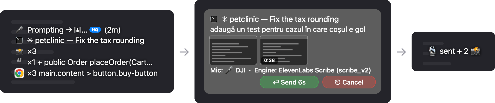
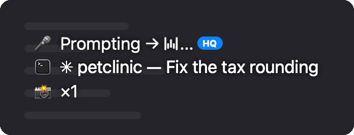
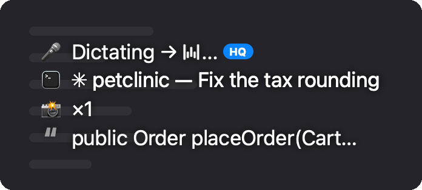
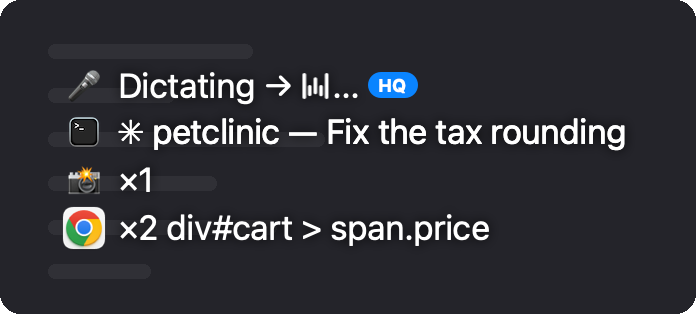
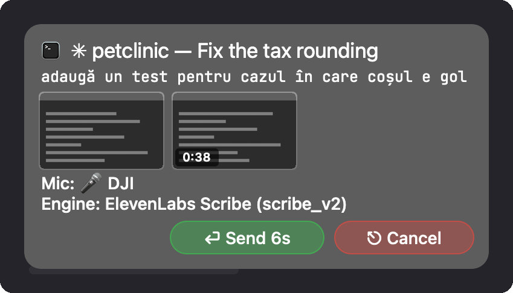
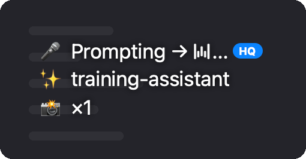
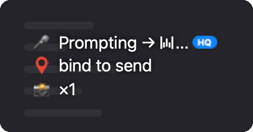

# 📻 Walkie Talkie

**Talk to your coding agent while you look at something else.**

A macOS overlay. You speak, it transcribes, and the prompt lands in your
Claude Code terminal, along with the screenshots, highlighted text and web
elements you pointed at while talking.

<p align="center">
  
  <br><sub>talk → a few seconds to check it → sent</sub>
</p>

## Why

- 👀 **Your eyes stay on the work**: a browser, an IDE, the projector. The terminal can sit behind other windows.
- 🎙️ **You speak instead of typing**, in Romanian, English or both mixed.
- 📸 **Context comes along**: screenshots, highlighted text, elements picked in Chrome.
- ⏱️ **You can still cancel**: every prompt waits a few seconds before it is sent.
- 🛡️ **It never types at a shell prompt**, only into a running agent.

## How it goes

| step | what you see |
|---|---|
| **1. Bind** a terminal running Claude Code: <kbd>⌘⌃B</kbd> | the chip by your cursor names the session |
| **2. Talk**: <kbd>⌘⌃D</kbd> to start, <kbd>⌘⌃D</kbd> again to stop |  |
| **3. Show it what you mean**: highlight some text… |  |
| …or <kbd>⌘⇧</kbd>-click an element in Chrome |  |
| **4. Check it**: the prompt waits ~6 s behind **Cancel**, then goes |  |

## More tricks

- ✨ **Start a new session by voice.** A new Terminal opens Claude Code with your sentence as its first prompt, in `~/workspace` or a folder you pick.
  <br>
- 🕐 **Nothing bound? Talk anyway.** The sentence waits 5 minutes for you to bind a terminal.
  <br>
- 💻 **The cloud is slow?** <kbd>⌘⌃X</kbd> transcribes on this Mac, right away.
- 🎵 **Your music pauses** in Chrome while you talk, and resumes after.
- 📋 **The clipboard always holds the last sentence**, so <kbd>⌘V</kbd> pastes it again.

## Keys

| key | does |
|---|---|
| <kbd>⌘⌃B</kbd> | bind the terminal in front (press again to let go) |
| <kbd>⌘⌃D</kbd> | start / stop a dictation |
| <kbd>⌘⌃X</kbd> | transcribe on this Mac, now |
| <kbd>⌘⇧</kbd>-click in Chrome | add that element to the prompt |

🖱️ It can also be driven entirely from the mouse, with Logitech side-button gestures or the
wheel. The menu bar icon lists every action next to the gesture that does it.

## Install

```bash
./build-app.sh          # → /Applications/Walkie Talkie.app
```

- 📦 Needs `victor-mac-kit` checked out next to this folder.
- 🔐 Grant **Accessibility**, **Screen Recording** and **Microphone** when asked.
- 🗣️ Pick a recogniser from the menu: **ElevenLabs Scribe** (key in `~/.walkie-talkie/elevenlabs.env`), a **local Whisper** (`pip install mlx-whisper`, plus `ffmpeg`) or **Wispr Flow**.
- 🧩 Optional, for picking elements in Chrome: `chrome://extensions` → Developer mode → **Load unpacked** → `chrome-extension/`.

👉 Every state the overlay can be in, photographed: [docs/overlay-states.html](docs/overlay-states.html)

<br>

---

# The long version

*For agents, and for anyone who wants the details.* This is the map. Every rule,
with the measurement or the incident behind it, lives in
[`.claude/rules/`](.claude/rules/) (one file per area) and
[`docs/journal.md`](docs/journal.md). Where they disagree with this page, they win.

The relay is **one-way and non-interactive** by design: the agent gets your words
and cannot ask anything back, because you are not reading the terminal.

## Where the words go

| destination | how you aim at it | what happens |
|---|---|---|
| **a bound terminal** | <kbd>⌘⌃B</kbd> on it | typed in and submitted, wherever your cursor is |
| **a new Claude Code session** | 🔼 ↑ | a new Terminal window starts `claude "<your words>"`, then gets bound |
| **the caret** | 🔼 (forward click) | pasted where you are typing; submitted if that is a Claude Code prompt |

- **Nothing bound? The sentence is held**, five minutes each, in order, and delivered on the next bind. The chip says `bind to send`; on expiry it says `⌘V to paste it`.
- **The recipient is fixed when the microphone closes.** Binding something else afterwards does not redirect a sentence already said. If its terminal is gone at delivery, the words go to the caret.
- **The clipboard always holds the last finished sentence**, so <kbd>⌘V</kbd> pastes it again.

### Bound terminals

| what | addressed by | delivered with | takes focus? |
|---|---|---|---|
| Terminal.app tab | its **tty** | `do script` | no |
| tmux pane | its **`%pane`** | `send-keys` | no |
| VS Code / IntelliJ terminal | the editor's extension ([`victor-vsc`](https://github.com/victorrentea/victor-vsc), [`live-coding`](https://github.com/victorrentea/live-coding)) | the terminal widget's own API | no |
| any other editor (fallback) | its pid | paste + Return | ~200 ms, then put back |

- **It never types at a shell prompt.** Before *every* delivery it checks the foreground job; a shell, or anything that hands the line to one (`ssh`, `sudo`, `less`, `docker`…), is refused. The test fails closed. At a prompt, a dictated *"delete the build folder"* would be run.
- **A raw chunk plus Return, never a bracketed paste**: Claude Code wraps a paste in `<pasted_content>` and the model treats it as data. Up to four more Returns follow if the sentence is still sitting under `❯`.
- Binding draws a blue rectangle that flies from the window into the chip; sending draws a white outline from the panel onto the terminal.

### A new session

- **🔼 ↑** (in Wheel mode: ⌘ + wheel click, or double click) aims the dictation at a session that does not exist yet. Mid-sentence it re-aims the open one.
- A **folder menu** pops up: active terminals, pinned and recent projects. Untouched, the folder is `~/workspace`.
- The prompt travels in **argv** (via a file, never through the keyboard), so it cannot be run by a shell, typed early, or mangled by quotes.

### The caret

- **🔼, the forward click**: a prompt at the caret, carrying everything below (screenshots, highlights, picks).
- **🔽 →, or right ⌘⌥ held**: a plain dictation, the words alone. Wispr Flow's habit, with this app's engine.

## What rides along with the words

Every attachment is a **token where you made it**, and a legend under the words says
where the files are. A real one:

```
[📸0🖱️@1958:1511 auto]
make the overlay draw above the screen grow effect, right now it ends up under it

kamikaze

[Dictated in RO or EN]
[📁=$WALKIE_SHOTS/2026-10-04-17-13-27]
[📸0 = 📁/screenshot-0-800px.jpg, or -original.jpg at 3456x2234px]
```

### Screenshots

- **📸0 is automatic**: the screen as it was when you started talking (`auto`), with where the pointer was (`🖱️@x:y`).
- **More shots**: the shutter (🔽 in Logi mode, the back button in Wheel mode) while a prompt records. The frame flies into the chip's 📸 and a red target blooms on the desktop where the pointer was. **Nothing is drawn into the picture**: a mark would cover what it points at.
- **A region**: hold the wheel and drag during a dictation (`✂️x,y→x,y` in the token). ⌘ moves the box, ⌥ draws it from the middle, Esc calls it off. It is Victor Addons' crop, shared through `victor-mac-kit`.
- **Two files per shot**: the retina original, and an 800 px copy that the agent reads. Same answers in the evals, about 40% fewer tokens.
- `$WALKIE_SHOTS` must be exported in `~/.zshrc`. It points at `~/Library/Caches/ro.victorrentea.wispr-relay/shots/` (the newest 300 frames are kept).

### Highlighted text

- **Highlighting is enough.** During a dictation the selection is read every second through Accessibility (never ⌘C, never the clipboard) and filed after three identical reads, plus once more when the microphone closes.
- The shutter reads it too, falling back to ⌘C with the clipboard restored. That is how a highlight inside a **Chrome page** gets in.
- The text lands **inside the sentence**, where you said it. If it cannot be placed, it goes in a list under the words, with `mm:ss` and the window it came from.

### Elements in Chrome

- **Hold ⌘⇧ for 400 ms** over a page during a dictation: the element under the cursor is outlined and named. **Click** it to add its selector, its text (up to 2000 chars) and the page URL. **Drag** it to say where to move it; the page itself never changes.
- Only live during a dictation, and only after the 400 ms hold, so a quick ⌘⇧-click still opens a link in a new tab.
- A Chrome extension ([`chrome-extension/`](chrome-extension/), loaded unpacked), not CDP: since Chrome 136, remote debugging is refused on the default profile. It talks to the relay on `127.0.0.1:8917–8919`.
- **Music pauses**: every audible Chrome tab is paused while a microphone is open, and exactly those resume after (WebSocket on `:8920`).

### Other markers

- **`kamikaze`** (🔼 ↓): appended on its own line, the agent's cue to close its terminal when done. Again to take it back.
- **`[voice: hesitant]` / `[voice: tense]`** and **`[?]` where you paused**: what the transcript loses. ElevenLabs only, since it needs word timings.

## The held prompt

- Shown whole, **held 4–7 s** (scaled by length) behind **Send** and **Cancel**. Once a line is in the terminal the agent may already be acting on it, so that is the only honest moment to cancel.
- <kbd>⏎</kbd> sends now. Clicking the words edits them, and the clock stops while you do.
- **Autosend** (menu) skips the buttons; the pointer on the panel still pauses it.
- Thumbnails carry the `m:ss` at which each shot was taken. With ElevenLabs, two sentences can be in flight at once, delivered in order.

## Recognisers

Picked from the menu's **Engine** row:

| engine | notes |
|---|---|
| ☁️ **ElevenLabs + Live** | Scribe, plus the words streaming beside the pointer as you speak |
| ☁️ **ElevenLabs** (default) | Scribe, one upload at the end; key in `~/.walkie-talkie/elevenlabs.env` |
| 💻 **Local** | Whisper on MLX (`pip install mlx-whisper` + `ffmpeg`); loaded at launch, ~2.5 GB resident |
| ☁️ **Wispr Flow** | its own app, behind a firewall: its ⌘V is dropped and the words are read from its History row |

- <kbd>⌘⌃X</kbd> **transcribes on this Mac now**: the take being recorded or uploaded goes to the local model instead. A cloud failure falls back to it automatically.
- The local interpreter is found by probing, not from `PATH` (an app launched by Finder gets launchd's bare `PATH`). `RELAY_WHISPER_PYTHON` and `RELAY_WHISPER_MODEL` override it.
- The **Mic** row picks the input. Automatic prefers a wireless receiver over the laptop microphone.

## Gestures

| key | |
|---|---|
| <kbd>⌘⌃B</kbd> | bind the terminal in front; on the bound one, let go |
| <kbd>⌘⌃D</kbd> | start / stop a dictation |
| <kbd>⌘⌃X</kbd> | the local model, now |

**Logi mode** (default, *Gestures* in the menu): the side buttons arrive as ⌃⌥⌘F3–F12 chords from
Logi Options+, and the app takes no mouse button at all.

| gesture | does |
|---|---|
| 🔼 → | start / stop a prompt at the bound terminal |
| 🔼 | a prompt at the caret |
| 🔼 ↑ | a prompt at a new session |
| 🔼 ← | cancel |
| 🔼 ↓ | kamikaze; within 3 s after a prompt landed in a terminal (`☠️ Kamikaze?` by the pointer): send `kamikaze` alone to it |
| ◀️ held, then 🔼 | bind the window in front |
| 🔽 → | start / stop a plain dictation at the caret (the stop inserts the words, no Return) |
| 🔽 | start / stop a plain dictation (ends in Return); the shutter while a prompt records |
| 🔽 ← | Return, at any moment |
| 🔽 ↓ | during a plain dictation: stop it, no Return; otherwise unbind |

**Wheel mode** needs no Logitech software: click the wheel to start and stop, hold 2 s to cancel,
left button held plus a wheel click to bind, right button held plus a wheel click to unbind, the
back button as the shutter.

The menu bar icon lists every action with its gesture. The spec is `evals/test_gesture_spec.py`,
the reasoning `.claude/rules/mouse-gestures.md`.

## The outbox

Each delivered message is also appended to `~/.walkie-talkie/outbox.jsonl`, **at delivery and
never before**: a held sentence leaves no trace. `kind` is `dictation` | `screenshot` |
`session_end`, and every line carries its `session`, so several relays can share one queue.

```json
{"ts":"2026-10-04T14:13:27Z","session":"walkie-talkie@master","kind":"dictation",
 "text":"…","line":"<the envelope, as typed>","screen":"…/screenshot-0-original.jpg",
 "selection":"…","selections":[{"at":"0:31","seconds":31,"text":"…","in":"<window>"}],
 "elements":[{"path":"div#cart > span.price","text":"…","url":"…","at":12}]}
```

Any agent that can tail a file can consume it. The Claude Code side is the `relay` skill in
[`victorrentea/skills-private`](https://github.com/victorrentea/skills-private).

## Loopback control

The relay listens on the first free port of **8917–8919**:

| route | |
|---|---|
| `POST /bind` · `POST /unbind` · `GET /target` | bind the front terminal · let go · what it is aimed at |
| `GET /engine` · `POST /engine {"id"}` | which recogniser, and is it ready · pick one |
| `GET /test/state` | `busy` and the rest of the live state |
| `POST /test/dictation {"text"}` | put a sentence through the whole path without speaking |
| `POST /test/spawn` | the same, at a new session |

About forty more `/test/*` routes drive every feature from a desk: see `.claude/rules/desk-testing.md`.

## The voice corpus

- Every dictation leaves its **WAV beside its transcript** in `~/.walkie-talkie/voice-corpus/` (about 35 MB a day, never pruned), so a recogniser can be judged, and later trained, on your own voice.
- `helpers/corpus_harvest.py` (a LaunchAgent, every 2 h) also copies Wispr Flow's recordings before Wispr prunes them after about a week, read-only.
- Measured on 60 clips (2026-09-01): the local turbo model is at **19.7% WER**, 22.7% on Romanian and 7.1% on English. Bigger models, a pinned language and a vocabulary prompt all made it worse, which is the case for a fine-tune. That work continues in `voice-distill`.
- `docs/teacher-loopback.md` covers labelling recordings by playing them back into Wispr. Read it before running `helpers/teacher_label.py`.

## Build and run

```bash
./relay-restart.sh --build     # build, wait for a quiet moment, swap the app, relaunch
```

- The restart **waits** until 5 s after the last dictation and refuses while anything is recording or transcribing. A bare `./build-app.sh` only when the app is not running: a bundle replaced under a running app breaks every bind.
- Launch it with `open "/Applications/Walkie Talkie.app"`, never by its executable path, which macOS registers as a second app for permissions.
- The `.app` is signed (`CODESIGN_IDENTITY`) because macOS keys Accessibility, Screen Recording and Microphone grants to the signing identity plus the bundle id (`ro.victorrentea.wispr-relay`, kept from its old name on purpose).
- Needs `../victor-mac-kit` checked out beside this folder.
- **After any overlay change, run `./docs/shoot-overlay-states.sh`.** It regenerates [the states page](docs/overlay-states.html) and the README's pictures.

## Debugging

- `~/.walkie-talkie/relay.log` is the log. `GET /test/state` is the live state.
- `kill -USR1 <pid>` writes what the overlay shows to `~/.walkie-talkie/snapshot.png`. The overlay is `sharingType = .none`, so it never lands in its own screenshots, and no screenshot can show it either.
- `POST /test/key-trace {"on":true}` logs every key the tap sees and what it decided.

## Licence

[The Unlicense](LICENSE): public domain. Take it, change it, ship it, sell it; no attribution required.
