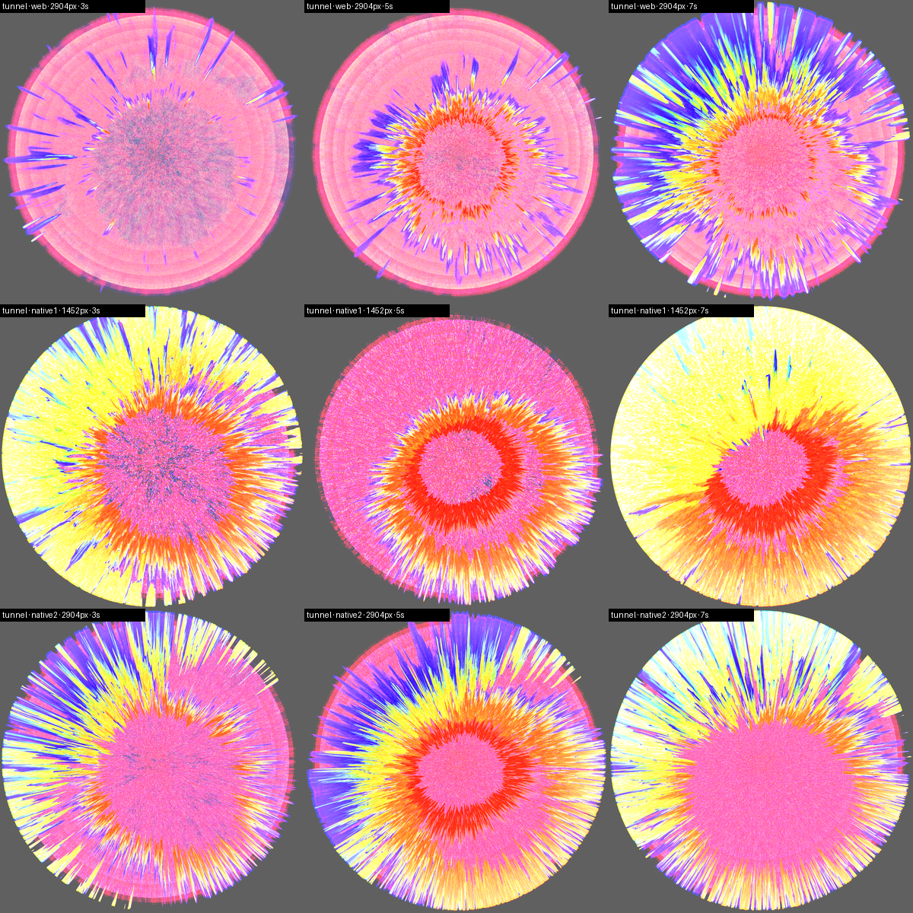
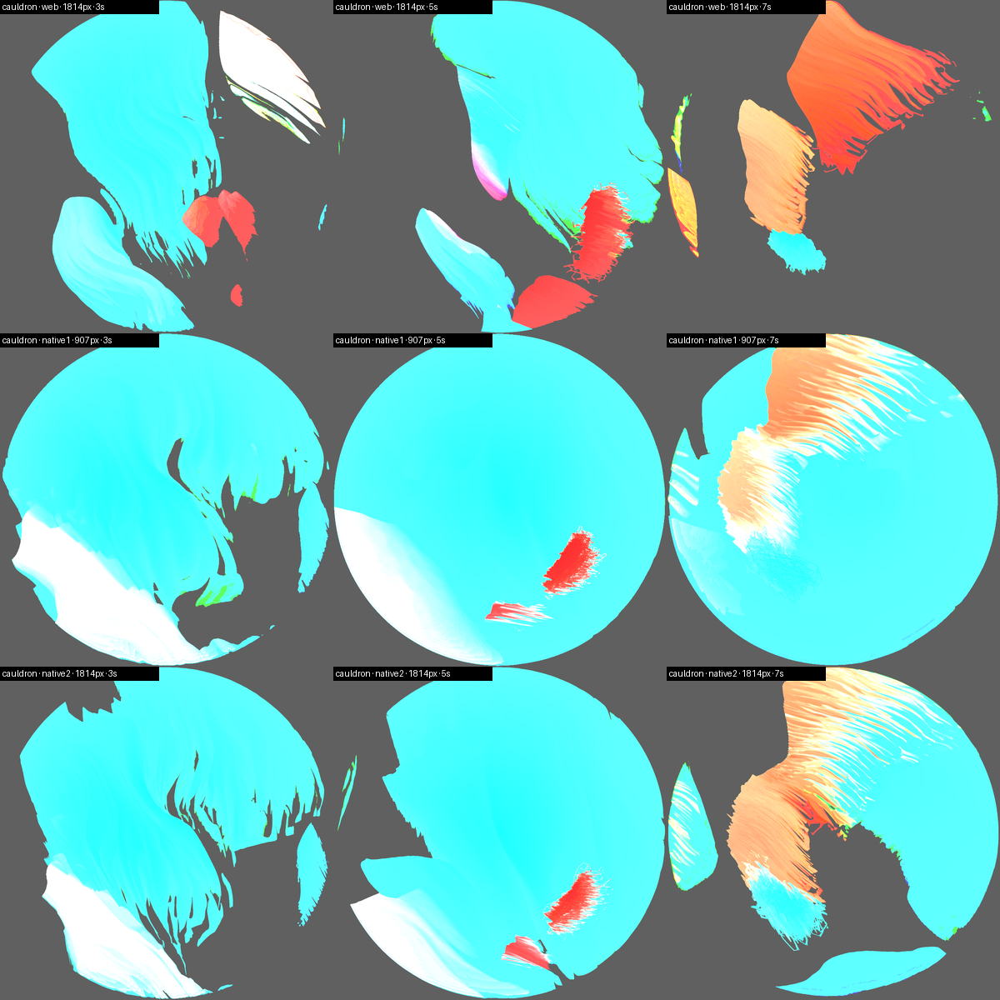
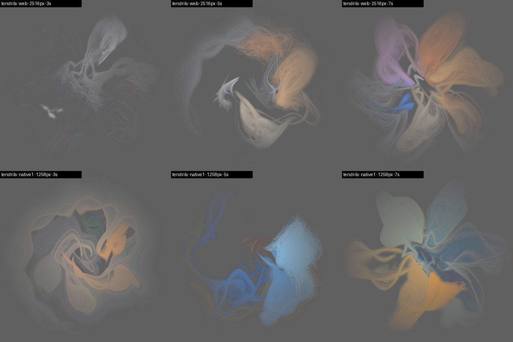
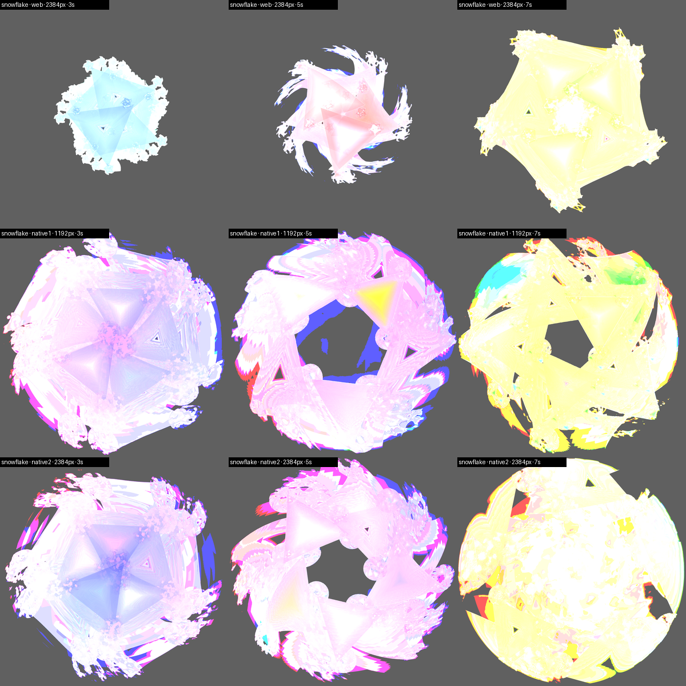
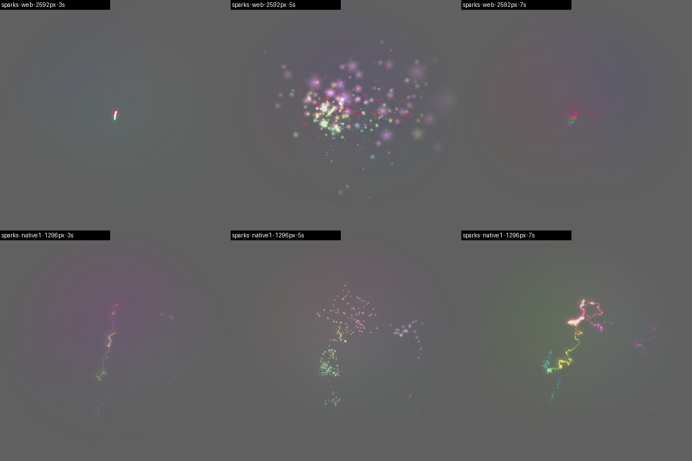
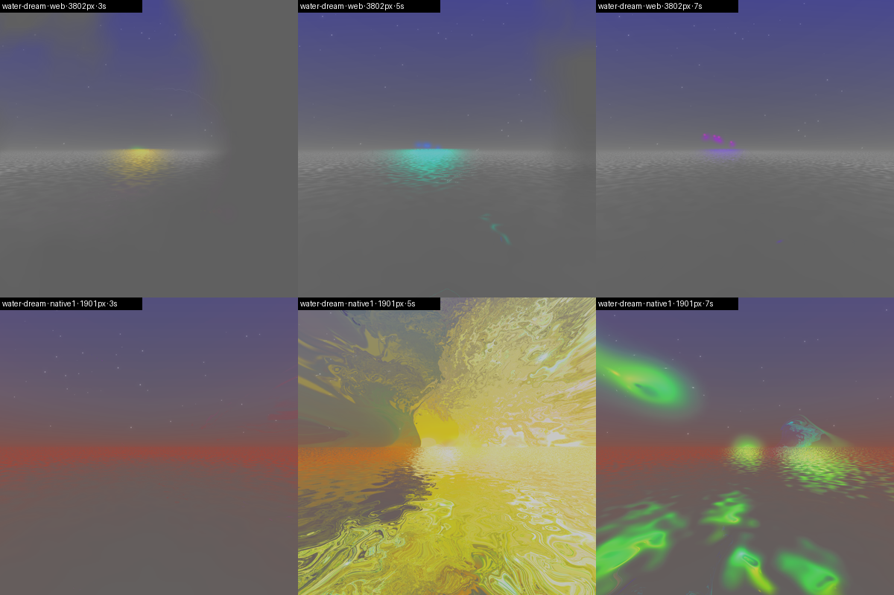

# The native MilkDrop halo on projectM — route B, built and measured (2026-09-21, overnight)

Branch `projectm`, worktree `walkie-talkie-projectm`. Nothing here touched the
installed app or `master`. The question asked: does a **native** projectM
renderer reach visuals comparable to butterchurn-in-a-`WKWebView` at clearly
less CPU and RAM? Short answer: **yes on cost, mostly on visuals** — the
composition, palette and motion match on four of the six presets; two respond
to the voice differently (Snowflake's star is bigger, Sparks' particles softer
and fewer), and every native preset is brighter than its web twin.

## Recommendation: ship as an opt-in engine, not yet the default

- **Cost**: the native route replaces the **40–96 % of a core** a web view
  spends in the two processes it spawns (its WebContent *and its own* WebKit
  GPU process — a census of Tunnel: GPU 56–59 %, WebContent 26 %) and its
  260–1100 MB of WebContent with **5–12 % in the app itself and no extra
  process**; the app's RSS *drops* (74 → 40 MB) because no `WKWebView` is
  built. A preset frame costs **0.7–3.5 ms of CPU** at either resolution, on a
  render queue of its own — the main thread only receives the surface.
- **Visuals**: Tunnel, Cauldron, Tendrils and Water Dream are the same picture;
  Snowflake and Sparks are recognisably the same preset but not the same
  frame. Victor has to look before this can be the default — the review
  command is at the end.
- **Something the measurement turned up**: the installed app's web halo
  (pid 57869, launched 23:37) kept a WebContent + WebKit GPU pair at **24 % +
  50 % of a core for the whole night with no dictation in flight**. The web
  route costs when it is *not* drawing; the native one costs nothing between
  dictations (its timer stops with the ring).

## What was built

- **`ProjectMHalo.swift`** — a `HaloWebHost` like `MilkDropHalo`: same start /
  stop / feed / center contract, the same square following the pointer, the
  same warm-up and fade-in, the same radial mask and `gain`, `rot` and
  `pinCenter` honoured (the last two as `per_frame_` lines appended to the
  preset's text, exactly what the page appends to the compiled equations).
  Selected by `WT_HALO_ENGINE=native` or the `haloEngine` default
  (`defaults write ro.victorrentea.wispr-relay haloEngine native`); the web
  route stays the default. `CaretHalo` asks `engineHost(...)` in the two places
  it built a `MilkDropHalo`, including the Water Dream hybrid's `under` layer.
- **`Sources/CProjectM/pmhalo.cpp`** — the GL glue: a CGL 3.2 core context,
  projectM into our own FBO, a keying pass (`a = max(r,g,b)`, the page's
  four-stop mask or the `fadeStart` fall, gain) into one of two IOSurfaces,
  which a `CALayer` shows. No `NSOpenGLView`, no readback per frame.
- **`vendor/projectm/`** — projectM 4.1.7 built static (`libprojectM-4.a` +
  `libprojectM_eval.a`, 2 MB) with `walkie.patch`, three changes:
  1. the two-line target-FBO patch from the spike (4.1.7 hard-binds FBO 0);
  2. every per-instance `glBufferSubData` on a streaming VBO replaced by an
     orphaning `glBufferData` — on Apple's GL-over-Metal each in-place update
     of a buffer the GPU may still be reading forces a **synchronous command
     buffer submit**; chain breaker (Sparks, 256 shape instances a frame) cost
     **21 ms a frame** before and **3.5 ms** after;
  3. the four exception classes override `what()` so the preset-failed callback
     says *Could not compile per-frame code* instead of `std::exception`.
- **`assets/projectm/presets/`** — the six presets as **original `.milk`
  files**. Three of them existed in this app only as butterchurn JSON; a
  subagent found the originals upstream (Tunnel Mix and Tendrils Colorfast in
  `clangen/projectM-musikcube`'s `presets_milkdrop_200`, fata morgana in
  `OfficialIncubo/BeatDrop-Music-Visualizer`), so no converter was needed.
  One edit: fata morgana splits the identifier `is_beat` over two
  `per_frame_` lines, which MilkDrop and butterchurn join verbatim and
  projectM joins with a newline — merged into one line, noted in the README.
- **Tooling** — `docs/projectm/sweep.sh` (the measurement), `shoot.sh` +
  `compose.py` (engine-only captures of both routes, `WT_MD_SHOOT` /
  `WT_PM_SHOOT`), `summarize.py` (the table). `build-app.sh` copies the preset
  folder; the engine is linked in, nothing else travels with the app.

## What it costs, measured

`top`, 1 s samples, ring up on the demo voice (`WT_HALO_DEMO=12
WT_HALO_DEMO_AUDIO=1`), 3456×2234 display, frame cap 30, `.build/debug`
binary, 2026-09-21 00:50–00:57 (`docs/projectm/sweep-2026-09-21.md`; two
earlier sweeps agree within noise). **"WebKit" is the sum of the two
processes the demo's web view spawned** — its WebContent and its own GPU
process (a census of a Tunnel run, 01:22: GPU 56–59 % at ~45 MB, WebContent
26 % at ~500 MB; the sweep's classifier only knew the GPU processes that
existed *before* the run, so it filed the new one under WebContent — the sum
is right, the split is in the census). The web route's numbers before this
branch (rule file: ~30 % WebContent + ~67 % GPU process, 280–330 + 240–290
MB) are the same shape. WindowServer sat at 20–40 % for every row, film
included; the native rows were re-measured after the render queue went in
(01:19) and did not move.

| preset | route | app CPU % | WebKit CPU % (WebContent + its GPU proc) | app RSS MB | WebContent RSS MB | native frame, CPU ms |
|---|---|---|---|---|---|---|
| film (lightning) | — | 0.1 | — | 47 | — | — |
| Tunnel | web (butterchurn, 2×) | 3.8 | 80.9 | 74 | 361 | — |
| Tunnel | native 1× | 6.0 | — | 40 | — | 0.98 |
| Tunnel | native 2× | 6.1 | — | 39 | — | 0.99 |
| Cauldron | web | 4.3 | 40.0 | 74 | 256 | — |
| Cauldron | native 1× | 4.9 | — | 39 | — | 1.04 |
| Cauldron | native 2× | 5.3 | — | 40 | — | 0.98 |
| Tendrils | web | 4.2 | 67.3 | 74 | 324 | — |
| Tendrils | native 1× | 7.7 | — | 40 | — | 2.26 |
| Tendrils | native 2× | 9.1 | — | 40 | — | 2.24 |
| Snowflake | web | 4.3 | 64.5 | 74 | 313 | — |
| Snowflake | native 1× | 5.9 | — | 40 | — | 1.05 |
| Snowflake | native 2× | 5.5 | — | 40 | — | 1.14 |
| Sparks | web | 4.2 | 76.5 | 74 | 350 | — |
| Sparks | native 1× | 10.1 | — | 48 | — | 3.45 |
| Sparks | native 2× | 10.4 | — | 47 | — | 3.54 |
| Water Dream (hybrid) | web | 5.8 | 95.6 | 75 | 1115 | — |
| Water Dream (hybrid) | native 1× | 7.6 | 17.6 | 88 | 548 | 1.00 |
| Water Dream (hybrid) | native 2× | 7.4 | 16.7 | 89 | 469 | 1.11 |

- **1× and 2× cost the same.** The engine's frame is CPU-bound in the
  per-frame and per-vertex code, not in pixels (as the spike found at 3456²);
  so the native route can render at the backing scale (`WT_PM_SCALE`, default 1
  — 2 costs nothing measurable and is the web route's resolution).
- **The app's 5–12 %** is the engine's CPU part (0.7–3.5 ms a frame) on its
  own queue, the IOSurface seed bump, and the `CATransaction` on the main
  thread. **At 60 fps** (`WT_HALO_FPS=60`, measured 01:19): Tunnel 8.6–10.7 %,
  Sparks 21 %, frames 286–301 per 5 s — it scales with the frame count, as
  expected; the web route at 60 fps was not cleanly measured.
- **Water Dream** still carries the `voice-halo` page for its comets
  (`HaloPage`, a second web view), so its WebContent column is the page, not
  the preset; the preset's share went from ~1100 MB to nothing.
- **Idle**: the native host's timer stops with the ring; between dictations it
  costs 0 %. See the finding above about the web route.

## What it looks like — `docs/projectm/captures/`

Engine-only frames (the keyed output, nothing of the screen in it) at 3, 5
and 7 s into the same demo voice, web (butterchurn at 2×) on the top row,
native 1× and 2× below, on a mid-grey ground. Statistics in
`captures-2026-09-21.md` (lit fraction, mean alpha of the lit part).

| preset | verdict |
|---|---|
|  **Tunnel** | Same composition (the hole, the burst, the magenta/yellow/blue palette), same 2× turn, centre pinned. Native is **brighter and fuller** (lit 30–57 % at alpha 130–170 vs 4–37 % at 80–124): at gain 4 more of the disc saturates. If that is too much, `gain` is per engine now (`WT_HALO_PRESET_OPTS='{"gain":2}'`). |
|  **Cauldron** | Same painterly cyan with the same red and orange strokes drifting through. Native keys **less to transparent** — the cyan wash fills the disc where butterchurn leaves dark gaps (alpha 66 vs 47–67, lit 30–46 % vs 15–25 %). |
|  **Tendrils** | **The closest match**: the same white bloom at 3 s, the same blue/red/green tendrils at 5 s, the same pale knot at 7 s. |
|  **Snowflake** | The same star ornament, the same colour cycle (blue → pink → yellow) — but native draws it **two to three times larger** and fills the disc; butterchurn's is a small star in the middle. Not the audio level (tested at 0.5×, 1×, 2×, 4× and resampled to 44.1 kHz — the size does not follow it); it is how the two engines size custom shapes/waves from `mid`. |
|  **Sparks** | The same disc of cycling colour behind; the sparks themselves differ: butterchurn draws chain breaker's 256 additive pentagons as **crisp points in a swarm**, projectM as **larger soft blobs along a chain**, fewer visible. This is the one preset Victor marked ★ where the native frame is the weaker one. |
|  **Water Dream** | Native renders the scene fata morgana was written for — sky, stars, a sea with reflections — and calmly; butterchurn's frames go **white** for stretches (Victor: *"too violent"*). Palettes cycle on both, so a given second differs. The comets are still the page's. |

Honest differences, in one place: native is brighter across the board (alpha
of the lit part ~1.3–1.8× on Tunnel and Cauldron); the mask, the pinned
centre and the doubled turn are verified identical (radial alpha profile,
the sweep's captures); Snowflake's scale and Sparks' particle look are engine
differences, not tuning; colours cycle with time so no two frames are the
same frame; no texture pack was needed (none of the six samples an external
texture; noise textures are built in).

## What went wrong on the way (so it is not paid for twice)

- **A CF object returned by a C function is `Unmanaged` in Swift.** Handed to
  `CALayer.contents` as it is, the layer shows nothing and nothing is logged.
  `takeUnretainedValue()`.
- **`wantsLayer = true` in `init` leaves `layer` nil** until AppKit's next
  display pass; a sublayer added then goes nowhere. The view is layer-hosting
  (`layer = CALayer()` first).
- **CA does not see a GPU write to an IOSurface.** It re-reads a surface when
  its *seed* moves, which only a CPU lock bumps — so with two surfaces
  alternating it kept showing the first frame each had ever held (a dark disc
  at alpha ≤ 20 on screen while the readback was bright). An empty
  `IOSurfaceLock`/`Unlock` per frame fixes it (`WT_PM_SYNC=nil` is the other
  way, clearing `contents` first; same cost).
- **The IOSurface's rows must be aligned** (`IOSurfaceAlignProperty`): a 907 px
  square (bpr 3628) aborted the process inside Metal with
  `isMisalignedIOSurface`. Cauldron 1× and Tendrils 1× died of it in the first
  sweep.
- **projectM leaves a GL error behind** on this driver (an unloadable texture
  unit it warns about itself); drained after the engine's pass and counted,
  never fatal.
- **The window capture of a `WKWebView` panel is empty** (`screencapture -l`
  gives the window's own layers, not WebKit's remote ones); the web route is
  only capturable off the whole screen, which is why the side-by-sides are
  engine readbacks rather than screenshots.
- **The two engines sample the same 16 kHz microphone as if it were 44.1
  kHz** (MilkDrop's beat detector reads bins, not hertz) — so the native route
  hands the samples over raw too (`WT_PM_RESAMPLE=1` resamples), for the same
  spectrum the presets were tuned against.

## Remaining work before it can be the default

1. **Victor's eye** on the six, live: `WT_HALO_ENGINE=native WT_HALO_STYLE=<case>
   WT_HALO_DEMO=11 WT_HALO_DEMO_AUDIO=1 ./.build/debug/WalkieTalkie` (under
   `hands-off run`); `WT_HALO_PRESET_OPTS='{"gain":2}'` to trim brightness.
2. **A menu row or a default** for `haloEngine` (`HaloEngine` exists; nothing
   writes it yet), and `build-app.sh` run once so `Resources/projectm` is in
   the bundle (the line is there; it was never run from this worktree).
3. **Snowflake and Sparks**: decide whether the native look is acceptable or
   whether the web route stays for those two (`engineHost` could pick per
   preset — a one-line change).
4. ~~A render thread~~ — done at 01:19: `renderQueue` (serial,
   `.userInteractive`), a `DispatchSourceTimer` on it, `pmh_render` and the
   PCM pushes there, the surface handed to the layer on the main thread. The
   `WT_HALO_DEMO=11` regression check (the arrow crossing `patience` at t=8)
   exits 0 on the native route.
5. **Upstream the patch** (or keep it): the orphaning buffer uploads are worth
   a projectM issue; the newline-joined `per_frame_` lines
   (`PresetFileParser::GetCode`) are a preset-compatibility bug there too.
6. **Water Dream's comets** are still the page's; the hybrid still opens a
   `WKWebView`. Either port the comets natively or accept the page for it.
7. **60 fps** was not measured (the cap is 30 everywhere); the engine's CPU
   part would double, ~10–20 % in the app.
8. The idle web-view cost of the installed app (the 24 % + 50 % pair, which
   the census shows is exactly one live web halo's WebContent + GPU process)
   deserves its own look — that is the web route's bill even before this
   branch. Nothing on this branch touched or measured the installed app
   beyond `ps`.

## How to reproduce

```
cd ~/workspace/walkie-talkie-projectm && swift build
docs/projectm/sweep.sh /tmp/sweep        # measurements → summarize.py → the table
docs/projectm/shoot.sh /tmp/shoot        # engine-only frames of both routes
python3 docs/projectm/compose.py /tmp/shoot docs/projectm/captures
```
